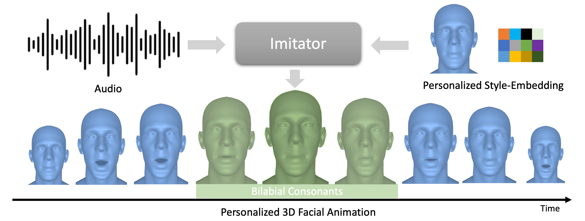

# Imitator: Personalized Speech-driven 3D Facial Animation
##### ICCV 2023


[**Imitator**](https://balamuruganthambiraja.github.io/Imitator/)<br/>
[Balamurugan Thambiraja](https://github.com/bala1144),
[Ikhsanul Habibie](),
[Sadegh Aliakbarian](),
[Darren Cosker](),
[Christian Theobalt](),
[Justus Thies]()<br/>


[arXiv](https://arxiv.org/abs/2301.00023) | [BibTeX](#bibtex) | [Project Page](https://balamuruganthambiraja.github.io/Imitator/)

###

### News
- Accepted to ICCV 2023
- Sep 27, 2023: Code uploaded. 
- Oct 16, 2023: Code issues fixed and added support for windows, Thanks to [sihangchen97](https://github.com/sihangchen97/Imitator/tree/main)

### To-Do

 - [ ] Releasing 3 personalized model[Boris, Kamala Harris, Trevor Noah] for style adaptation comparison on the external actors.
   (If you need it immediately for upcoming CVPR 2024 deadline, please write me a mail)

## Installation

Linux:
```
git clone https://github.com/bala1144/Imitator.git
cd Imitator
bash install.sh
```

Windows:
```
git clone https://github.com/bala1144/Imitator.git
cd Imitator
install.bat
```

Mac:

Follow the linux commands and use the `dowload_asset.sh`. Make sure to install `wget`, except change line 7 of `install.sh` to the version of python your machine is running.


## Overview of pretrained models
Linux and Mac:
```
bash download_asset.sh
```

Windows:
```
download_asset.bat
```

We will update 3 pretrained models
- generalized_model_mbp (Generalized model on VOCAset)
- subj0024_stg02_04seq (FaceTalk_170731_00024_TA personalized model)
- subj0138_stg02_04seq (FaceTalk_170731_00024_TA personalized model)

## Data Preparation

### VOCA
Download the [VOCA](https://voca.is.tue.mpg.de/) and prepare using the script from [Faceformer](https://github.com/EvelynFan/FaceFormer)
```
git clone https://github.com/EvelynFan/FaceFormer.git
cd FaceFormer/vocaset
python process_voca_data.py
cd ../..
```

### wav2vec model (optional, for offline use)

Download wav2vec model, for example [wav2vec2-base-960h](https://huggingface.co/facebook/wav2vec2-base-960h) from [HuggingFace](https://huggingface.co/).

### Overriding config file (optional)

The directories of VOCA dataset and wav2vec model might differ from one to one. 

Set environment variables (`VOCASET_PATH`, `WAV2VEC_PATH`) to run test scripts mentioned above, if you find it hard to find or modify config files (*.yaml).

Linux:
```
export VOCASET_PATH=<Path to vocaset folder>
export WAV2VEC_PATH=<Path to wav2vec model folder (e.g. wav2vec2-base-960h)>
```

Windows:
```
set VOCASET_PATH=<Path to vocaset folder>
set WAV2VEC_PATH=<Path to wav2vec model folder (e.g. wav2vec2-base-960h)>
```


## Testing 

### on external audio

To evaluate the external audio, you can use the demo audio on the `assets/demo/`
```
python imitator/test/test_model_external_audio.py -m pretrained_model/generalized_model_mbp_vel --audio assets/demo/audio1.wav -t FaceTalk_170731_00024_TA -c 2 -r -d 
```
- `-a` path to the audio file
- `-t` specify the subject of the VOCA
- `-c` specify the condition[0,1...7] from VOCA used for testing
- `-r` to render the results as videos
- `-d` to dump the prediction as npy files

### on VOCA
To evaluate the generalized/personalized model on VOCA
```
python imitator/test/test_model_voca.py -m pretrained_model/generalized_model_mbp_vel -r -d
python imitator/test/test_model_voca.py -m pretrained_model/subj0024_stg02_04seq -r -d
python imitator/test/test_model_voca.py -m pretrained_model/subj0138_stg02_04seq -r -d
```
- `-c` to specify the config of the dataset; edit the imitator/test/data_cfg.yml to point to your dataset path.

## Training models

### Generalized

Train the generalized model on VOCA with
```
python main.py -b cfg/generalized_model/imitator_gen_ab_mbp_vel10.yaml --gpus 0,
```

### Personalized model

First stage of the personalization, we optimize for the Style code using model from generalized model
```
python main.py -b cfg/style_adaption/subj0024_stg01_04seq.yaml --gpus 0,
```

Second stage of the personalization, we optimize for the Style code and Displacements using the model from Stage 01
```
python main.py -b cfg/style_adaption/subj0024_stg02_04seq.yaml --gpus 0,
```

## More

## Shout-outs
Thanks to everyone who makes their code and models available. In particular,

- The architecture of our method is inspired by [Faceformer](https://github.com/EvelynFan/FaceFormer)
- Our repo is built on top of the repos of [Taming_Tranformers](https://github.com/CompVis/taming-transformers) and  [Faceformer](https://github.com/EvelynFan/FaceFormer)
- related works  [Faceformer](https://github.com/EvelynFan/FaceFormer), [codetalker](https://github.com/Doubiiu/CodeTalker), [VOCA](https://github.com/TimoBolkart/voca) and [Meshtalk](https://github.com/facebookresearch/meshtalk)

## BibTeX

```
@InProceedings{Thambiraja_2023_ICCV,
    author    = {Thambiraja, Balamurugan and Habibie, Ikhsanul and Aliakbarian, Sadegh and Cosker, Darren and Theobalt, Christian and Thies, Justus},
    title     = {Imitator: Personalized Speech-driven 3D Facial Animation},
    booktitle = {Proceedings of the IEEE/CVF International Conference on Computer Vision (ICCV)},
    month     = {October},
    year      = {2023},
    pages     = {20621-20631}
}
```
